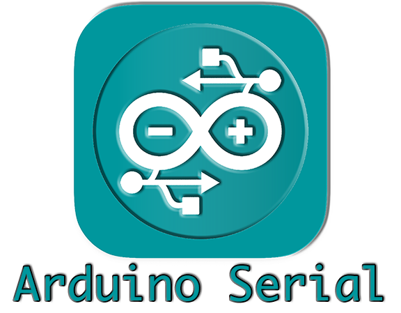

# A light Serial interface for your Arduino needs.

### Benefits of ArduinoSerial over the IDE Serial interface:

- Simultaneously open multiple serial ports
- Create a filter list where only text lines coming from your Arduino will be shown if they have words in the filter list (for one String coming from Arduino, only one word from the list needs to match)
    - Chose to have your filter list preserved between program launches. 
- Toggle feature to automatically clear the display for each incoming serial line (avoid scrolling)
- When  you go to any other window, Arduino Serial will automatically close any open com ports, so that you don't have to manually close the ports before uploading your sketches.
  - When you click back on Arduino Serial, all previously closed com ports will automatically re-opened.
- Serial ports show up in tabs with a text field on top of the tabs. Type in your text and hit enter and Arduino Serial will send that text to that tabs serial port.
- Automatically records your window size and when you re-open Arduino Serial, that size is restored.

## Installation

Click on releases to the right and download your installer, Mac installer currently, Windows coming soon.
